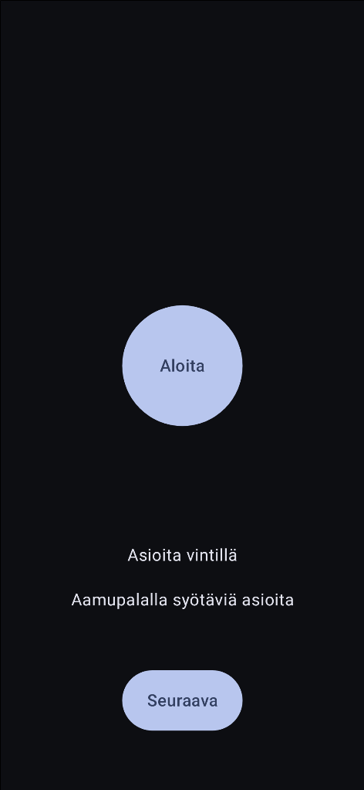

### The home screen

### The timer screen

Pressing 'Seuraava' (Next) gives two new random topics for the board game Tapple.
There's also a light mode version that is enabled if the user's phone is in light mode.

Pressing 'Aloita' (Start) opens the timer screen which does not indicate how much time is left.
The original board game doesn't have a visible timer either. However, since I wanted to make the
game playable without sound (only vibration) the screen flashes red when it is tapped so the user
knows that the tap was recognized by the device.

ding.mp3 sound effect by [freesound community](https://pixabay.com/users/freesound_community-46691455/?utm_source=link-attribution&utm_medium=referral&utm_campaign=music&utm_content=36029) from Pixabay.
buzzer.mp3 sound effect by [Nhựt Bùi](https://pixabay.com/users/eritnhut1992-25656588/?utm_source=link-attribution&utm_medium=referral&utm_campaign=music&utm_content=20582) from Pixabay.